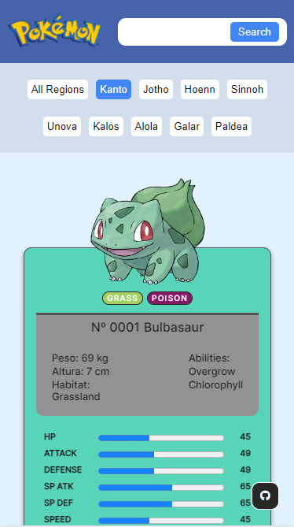

You can read this doc in Portuguese by clicking [here](./README.md)

  

## ReactJS Pokédex

This is a project of a Pokédex developed using ReactJS. The Pokédex is a virtual encyclopedia that contains information about various Pokémon, including their names, types, abilities, descriptions, and statistics.

## Technologies Used

- HTML
- CSS
- JavaScript
- ReactJS
- PokéAPI

### Demo:

Link to the live application: [https://filipelimavaz-pokedex.netlify.app/](https://filipelimavaz-pokedex.netlify.app/)

### Features:

- **Pokémon Listing**: View a complete list of Pokémon with their respective information.
- **Search and Filtering**: Search for Pokémon by name or filter them by region.
- **Responsiveness**: The application is responsive and can be used on mobile devices and desktops.

### PokéAPI Data Collection:

To provide accurate and up-to-date information about Pokémon, the application consumes an API called PokéAPI. This free API offers a wide range of data about all Pokémon, including details such as name, type, abilities, description, images, statistics, and more.

## Utilization of Object-Oriented Concepts and MVC Pattern

In the implementation of this Pokédex, object-oriented concepts and the MVC (Model-View-Controller) pattern were used. Utilizing the MVC pattern and object-oriented programming allows for creating a well-structured, modular, and easily maintainable application. This also facilitates the addition of new features and the expansion of the application in the future. Here's a brief explanation of how these concepts were applied:

- **Model:** Represents the application's data and its structure. We use classes to model the different types of Pokémon data, such as name, type, abilities, and statistics. These models provide a clear structure for the data that will be displayed in the application.

- **View:** Responsible for presenting the data to users. In our application, the views are React components that display Pokémon information in the user interface. Each component is designed to visually represent the data according to the application's needs.

- **Controller:** Coordinates the interaction between the model and the view. In this project, we implemented a service to handle communication with the PokéAPI and retrieve Pokémon data. This service acts as an intermediary between the application and the API, simplifying business logic and improving code maintenance.

## Utilization of React Hooks and Fetch Methods

### `useState`

`useState` is one of the most used React Hooks. It allows you to add state to functional components in React. In this project, it was used to manage the local state of components, such as storing the data of the Pokémon fetched from the PokéAPI.

### `useEffect`

`useEffect` is another essential React Hook that allows you to perform side effects in functional components. In this project, it was used to fetch data from the PokéAPI as soon as the component is mounted, ensuring that the data was ready to be displayed when needed.

### Fetch

The `fetch` method is native to JavaScript and is widely used to make asynchronous HTTP requests. In this project, `fetch` was used to make requests to the PokéAPI and retrieve Pokémon data. Once received, this data can be processed and displayed in the user interface.

## Event Handling

### `onClick`

The `onClick` event is triggered when an element is clicked by the user. In this project, it was used to trigger events through buttons.

### `onKeyPress`

The `onKeyPress` event is triggered when a key is pressed while an element is focused. It is useful for capturing keyboard actions. In this project, it was used to capture the Enter key in the search field.

### `onChange`

The `onChange` event is triggered when the value of a form element is changed by the user. It is commonly used in text inputs, selects, and checkboxes. In this project, it was used to capture changes in the search field.

## Screenshots

Some screenshots:

| Desktop | Smartphone |
|----------------|---------------|
|  |  |

### Developer:

This project was developed by [Filipe de Lima Vaz](https://www.linkedin.com/in/filipe-de-lima-vaz/). Feel free to check out the GitHub repository for more details and contributions.
