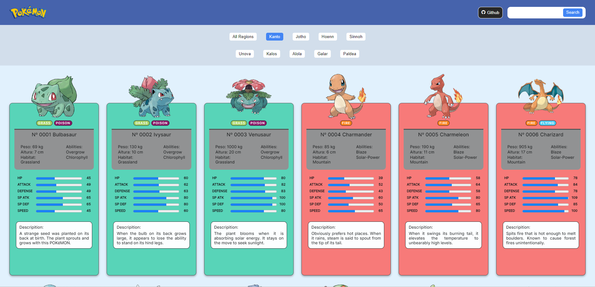
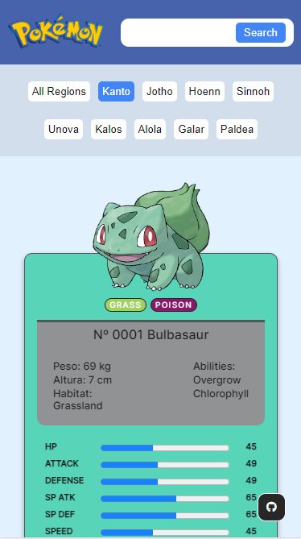

You can read this doc in english by clicking [here](./README-english.md)

  

## ReactJS Pokédex

Este é um projeto de uma Pokédex desenvolvida utilizando ReactJS. A Pokédex é uma enciclopédia virtual que contém informações sobre diversos Pokémon, incluindo seus nomes, tipos, habilidades, descrições e estatísticas.

## Tecnologias Utilizadas

- HTML
- CSS
- JavaScript
- ReactJS
- PokéAPI

### Demonstração:

⚠️Por favor tenha paciência ao utilizar a aplicação⚠️
⚠️Ela está hospedada em um servidor gratuito e pode demonstrar instabilidade⚠️
Link da aplicação online: [https://filipelimavaz-pokedex.netlify.app/](https://filipelimavaz-pokedex.netlify.app/)

### Recursos:

- **Listagem de pokémons**: Visualize uma lista completa de Pokémon com suas respectivas informações.
- **Pesquisa e Filtragem**: Pesquise os Pokémon pelo nome ou filtre-os por região.
- **Responsividade**: O aplicativo é responsivo e pode ser utilizado em dispositivos móveis e desktop.

### Coleta de Dados da PokéAPI:

Para fornecer informações precisas e atualizadas sobre os Pokémon, a aplicação consome uma API chamada PokéAPI. Esta API gratuita oferece uma vasta gama de dados sobre todos os Pokémon, incluindo detalhes como nome, tipo, habilidades, descrição, imagens, estatísticas, entre outros.

## Utilização de Conceitos de Orientação a Objetos e Padrão MVC

Na implementação desta Pokédex, foram usados conceitos de orientação a objetos e o padrão MVC (Model-View-Controller). Utilizar o padrão MVC e orientação a objetos permite criar uma aplicação bem estruturada, modular e de fácil manutenção. Isso também facilita a adição de novos recursos e a expansão da aplicação no futuro. Aqui está uma breve explicação de como esses conceitos foram aplicados:

- **Model (Modelo):** Representa os dados da aplicação e sua estrutura. Utilizamos classes para modelar os diferentes tipos de dados dos Pokémon, como nome, tipo, habilidades e estatísticas. Esses modelos fornecem uma estrutura clara para os dados que serão exibidos na aplicação.

- **View (Visualização):** Responsável pela apresentação dos dados aos usuários. Na nossa aplicação, as visualizações são os componentes React que exibem as informações dos Pokémon na interface do usuário. Cada componente é projetado para representar visualmente os dados de acordo com as necessidades da aplicação.

- **Controller (Controlador):** Coordena a interação entre o modelo e a visualização. Neste projeto, implementamos um serviço (service) para lidar com a comunicação com a PokéAPI e a coleta dos dados dos Pokémon. Este serviço atua como um intermediário entre a aplicação e a API, simplificando a lógica de negócios e melhorando a manutenção do código.

## Utilização de React Hooks e Métodos de Fetch

### `useState`

O `useState` é um dos React Hooks mais utilizados. Ele permite que você adicione estado a componentes de função em React. Neste projeto ele foi utilizado para controlar o estado local dos componentes, como, por exemplo, para armazenar os dados dos Pokémon que foram buscados na PokéAPI.

### `useEffect`

O `useEffect` é outro React Hook essencial que permite que você realize efeitos colaterais em componentes funcionais. Neste projeto ele foi utilizado para buscar dados da PokéAPI assim que o componente for montado, garantindo que os dados estivessem prontos para serem exibidos quando necessário.

### Fetch

O método `fetch` é nativo do JavaScript e é amplamente utilizado para fazer requisições HTTP assíncronas. Nes projeto eu utilizei o `fetch` para fazer requisições à PokéAPI e obter os dados dos Pokémon. Esses dados, uma vez recebidos, podem ser processados e exibidos na interface do usuário.

## Manipulação de Eventos

### `onClick`

O evento `onClick` é acionado quando um elemento é clicado pelo usuário. Neste projeto ele foi utilizado para disparar evento através dos botões.

### `onKeyPress`

O evento `onKeyPress` é acionado quando uma tecla é pressionada enquanto um elemento está focado. Ele é útil para capturar ações do teclado. Neste projeto ele foi utilizado para capturar a tecla Enter no campo de busca.

### `onChange`

O evento `onChange` é acionado quando o valor de um elemento de formulário é alterado pelo usuário. Ele é muito utilizado em inputs de texto, selects e checkboxes. Neste projeto ele foi utilizado para capturar mudanças no campo de busca.

## Screenshots

Algumas screenshots:

| Computador | Smartphone |
|----------------|---------------|
|  |  |

### Desenvolvedor:

Este projeto foi desenvolvido por [Filipe de Lima Vaz](https://www.linkedin.com/in/filipe-de-lima-vaz/). Sinta-se à vontade para conferir o repositório no GitHub para mais detalhes e contribuições.
